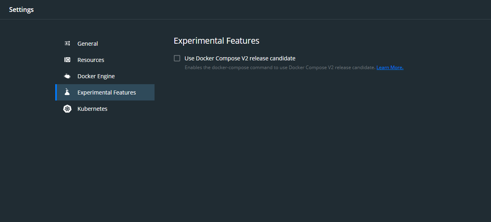
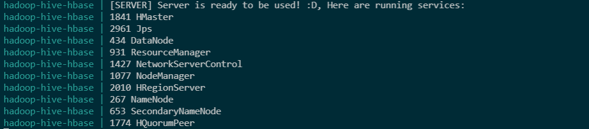

# Hadoop Hive Hbase Single Node

Please be sure you already have docker installed and uncheck "Use Docker Compose V2 release candidate" at docker preferences > experimental features.

  

    
  

### First Run or Rebuild Docker Image: 
    docker-compose up -d --build

### Normal Run: 
    docker-compose start

### Stop container: 
    docker-compose stop

### Delete container: 
    docker-compose down

### Connect to container: 
    docker exec -it hadoop-hive-hbase bash

### Delete container: 
    docker-compose down

## Succesfull Output

  

    
  

